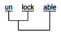
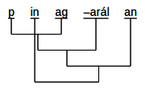

# diagsap
DiagSap is a tool to create Philippine-style word diagrams (DiagSap is short for "diagramang sapin-sapin" which is Tagalog for "layered diagram.")

DiagSap can be used to produce diagrams such as the following:

## Download

You can download 64bit installers for Windows, Mac OS X, and Linux.  The latest version is 1.2.0.

### Windows
Click [HERE](https://drive.google.com/file/d/1KftLCRffZcZy998mmI_4O9jXtsAHa1ox/view?usp=sharing) to get the latest installer.  Run it as Administrator.

### Mac OS X
Click [HERE](https://drive.google.com/file/d/19qECdiQ8Wo6SZOCsJRr9Vi6JUoFP4KhP/view?usp=sharing) to get the latest installer.

### Linux
Click [HERE](https://drive.google.com/file/d/1adVzMmusBQN45m2DU94BwUd8I9ceE4Tu/view?usp=sharing) to get the latest installer.  Use
> `sudo dpkg -i diagsap-64bit-1.2.0.0`

to install and

> `sudo dpkg -r diagsap-64bit-1.2.0.0`

to remove it.

## Samples
A zip file containing some sample descriptions is available [HERE](https://drive.google.com/file/d/1Ci13NeW0PGXN_w3xOBPIhgN2jjciB0D7/view?usp=sharing).
