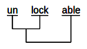
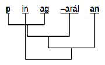

# diagsap
DiagSap is a tool to create Philippine-style word diagrams (DiagSap is short for "diagramang sapin-sapin" which is Tagalog for "layered diagram.")

DiagSap can be used to produce diagrams such as the following:

## Download

You can download 64bit installers for Windows, Mac OS X, and Linux.  The latest version is 1.3.0.

### Windows
Click [HERE](https://software.sil.org/downloads/r/lingtree/DiagSap/DiagSap-1.3.0.exe) to get the latest installer.

### macOS
Click [HERE](https://software.sil.org/downloads/r/lingtree/DiagSap/DiagSap-1.3.0.dmg) to get the latest installer.

### Linux (22.04)
Click [HERE](https://software.sil.org/downloads/r/lingtree/DiagSap/DiagSap-1.3.0-22.04.deb) to get the latest installer.  Use
> `sudo dpkg -i DiagSap-1.3.0-22.04`

to install and

> `sudo dpkg -r diagsap`

to remove it.

### Linux (24.04)
Click [HERE](https://software.sil.org/downloads/r/lingtree/DiagSap/DiagSap-1.3.0-24.04.deb) to get the latest installer.  Use
> `sudo dpkg -i DiagSap-1.3.0-24.04`

to install and

> `sudo dpkg -r diagsap`

to remove it.

## Samples
A zip file containing some sample descriptions is available [HERE](https://drive.google.com/file/d/1Ci13NeW0PGXN_w3xOBPIhgN2jjciB0D7/view?usp=sharing).
